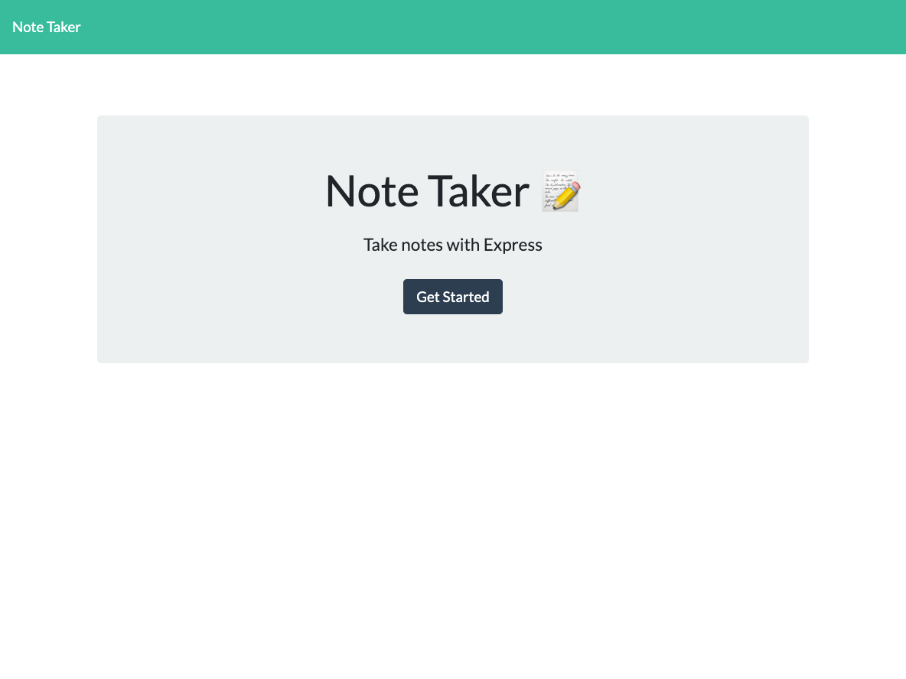
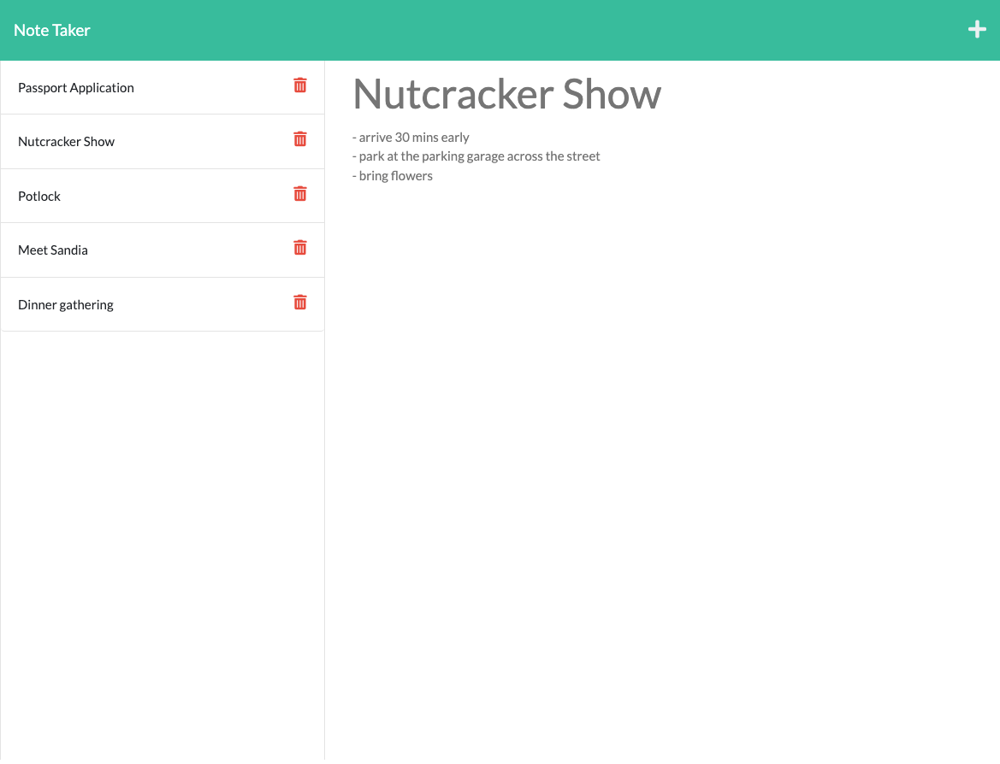

# Note-Taker 

## Description

This application allows users to write and save notes. It is implemented using Express.js as back end, and using JSON file as notes data storage.

## Table of Contents
* [Installation](#installation)
* [Usage](#usage)
* [Screenshot](#screenshot)
* [Credits](#credits)
* [License](#license) 

## Installation

N/A

## Usage

 - Here is the link [https://heidi-note-taker.herokuapp.com/notes](https://heidi-note-taker.herokuapp.com/notes) for the deployed application.
- When the application is opened, a landing page will be presented with a link to a notes page.
- When the link to the notes page is clicked, a page will be presented with existing notes listed in the left-hand column, and empty fields to enter a new note title and the note's text in the right-hand column.
- When users enter a new note title and the note's text, a SAVE icon appears in the navigation at the top right of the page.
- When users click on the SAVE icon, the new note is saved and appears in the lett-hand column with the other existing notes.
- When users click on an existing note in the list in the left-hand column, that note appears in the right-hand column.
- When users click on the DELETE button next to an existing note, that note will be deleted.
- When users click on the WRITE icon (+) in the navigation at the top right of the page, empty fields will be presented to enter a new note title and the note's text in the right-hand column.

## Screenshot

Landing Page

Notes Page

## Credits

N/A

## License

MIT